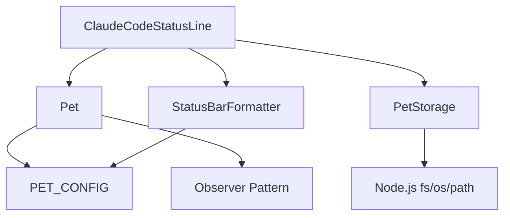

# Project Structure

## Directory Layout

```plaintext
ccpet/
├── dist/                   # Compiled CLI script output directory  
│   ├── extension.js        # Executable CLI status line script
│   └── extension.js.map    # Source map for debugging
├── src/                    # Source code directory
│   ├── core/               # Core business logic
│   │   ├── Pet.ts          # Pet state and energy bar core class/module
│   │   ├── config.ts       # Application configuration constants
│   │   └── __tests__/
│   │       └── Pet.test.ts
│   ├── services/           # Services for external system interaction
│   │   ├── PetStorage.ts   # Local filesystem state persistence
│   │   └── __tests__/
│   │       └── PetStorage.test.ts
│   ├── ui/                 # UI related code
│   │   ├── StatusBar.ts    # Status bar display formatter (StatusBarFormatter)
│   │   └── __tests__/
│   │       └── StatusBar.test.ts
│   ├── __tests__/          # Integration tests
│   │   ├── extension.test.ts
│   │   ├── integration/
│   │   │   └── PetIntegration.test.ts
│   │   └── setup.ts        # Global test setup
│   └── extension.ts        # CLI script main entry file
├── docs/                   # Project documentation
│   ├── architecture/
│   ├── qa/
│   └── stories/
├── .gitignore
├── .prettierrc.json        # Prettier configuration file
├── esbuild.config.js       # esbuild configuration file
├── package.json            # Project dependencies and scripts
├── tsconfig.json           # TypeScript configuration file
└── vitest.config.ts        # Vitest configuration file
```

## Core Architecture Layers

### Business Logic Layer (`src/core/`)

- **Pet.ts**: Central state management for pet energy, expressions, and lifecycle
- **config.ts**: Application-wide configuration constants and thresholds

### Service Layer (`src/services/`)

- **PetStorage.ts**: Handles persistence of pet state to filesystem (`~/.claude-pet/pet-state.json`)

### UI Layer (`src/ui/`)

- **StatusBar.ts**: StatusBarFormatter class that converts pet state to CLI output format

### CLI Entry Point (`src/extension.ts`)

- **ClaudeCodeStatusLine**: Main CLI class that orchestrates all components
- **main()**: CLI execution function that outputs pet status and saves state

## Data Flow Architecture

```mermaid
graph TD
    A[CLI Execution] --> B[ClaudeCodeStatusLine]
    B --> C[PetStorage.loadState()]
    C --> D[Pet.constructor()]
    D --> E[Pet.applyTimeDecay()]
    E --> F[StatusBarFormatter.formatPetDisplay()]
    F --> G[process.stdout.write()]
    B --> H[PetStorage.saveState()]
```

## Component Dependencies



## File Size and Complexity Guidelines

| Layer | Max File Size | Max Function Length | Complexity Limit |
|-------|--------------|-------------------|------------------|
| Core Logic (`Pet.ts`) | 500 lines | 20 lines | Moderate |
| Services (`PetStorage.ts`) | 200 lines | 15 lines | Low |
| UI (`StatusBar.ts`) | 150 lines | 10 lines | Low |
| Entry Point (`extension.ts`) | 100 lines | 15 lines | Low |

## State Management Flow

### State Persistence

```
┌─────────────────┐    ┌──────────────────┐    ┌─────────────────┐
│   CLI Start     │───▶│   Load State     │───▶│  Create Pet     │
│                 │    │ PetStorage.load()│    │   Instance      │
└─────────────────┘    └──────────────────┘    └─────────────────┘
                                                        │
┌─────────────────┐    ┌──────────────────┐    ┌─────────────────┐
│   CLI End       │◀───│   Save State     │◀───│   Pet State     │
│  process.exit() │    │ PetStorage.save()│    │   Changes       │
└─────────────────┘    └──────────────────┘    └─────────────────┘
```

### State Location

- **Runtime State**: Memory within Pet class instance
- **Persistent State**: `~/.claude-pet/pet-state.json` on filesystem
- **Configuration**: `~/.claude/settings.json` (Claude Code settings)

## Testing Structure

### Unit Tests
- `src/core/__tests__/Pet.test.ts` - Pet business logic
- `src/services/__tests__/PetStorage.test.ts` - Storage operations
- `src/ui/__tests__/StatusBar.test.ts` - Display formatting

### Integration Tests
- `src/__tests__/extension.test.ts` - CLI main class integration
- `src/__tests__/integration/PetIntegration.test.ts` - Cross-component integration

### Test Coverage Targets
- Core Logic: >90%
- Services: >85% 
- UI Components: >80%
- Integration: >70%

## Build Output

### Development Build
```bash
npm run build
# Produces: dist/extension.js (readable)
#          dist/extension.js.map (source maps)
```

### Production Build
```bash
npm run build --minify
# Produces: dist/extension.js (minified)
#          dist/extension.js.map (source maps)
```

## CLI Script Characteristics

- **Executable**: Has shebang `#!/usr/bin/env node`
- **Permissions**: Must be executable (`chmod +x`)
- **Output**: Writes pet status to stdout
- **Error Handling**: Writes errors to stderr, exits with code 1
- **Performance**: Completes execution in <100ms
- **Dependencies**: Only Node.js built-ins (no external packages)

## Integration Points

### Claude Code Configuration
```json
{
  "statusLine": {
    "type": "command",
    "command": "/path/to/ccpet/dist/extension.js",
    "padding": 0
  }
}
```

### Filesystem Dependencies
- **State Storage**: `~/.claude-pet/pet-state.json`
- **Directory Creation**: Automatic via `fs.mkdirSync`
- **Error Recovery**: Graceful fallback to default state

## Deployment Structure

```
Production Deployment:
├── dist/extension.js       # Deployed CLI script
├── package.json           # For metadata only  
└── README.md             # User instructions

Development Environment:
├── Full source tree      # For development and testing
├── node_modules/         # Development dependencies
└── All config files      # Build and test configuration
```